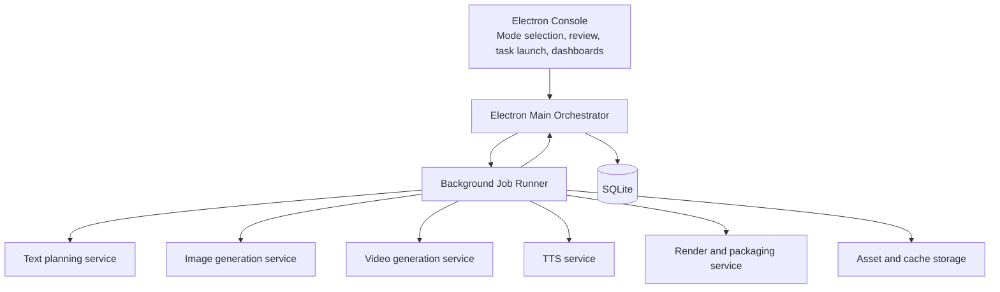
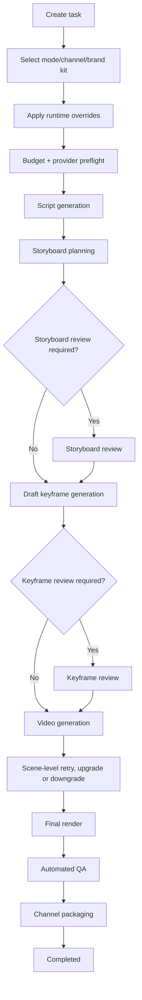

# V2 Social Video Factory Redesign

Date: 2026-04-17
Status: Draft for review
Scope: Full V2 redesign for an AI-driven, batch-oriented social media video production system.

## 1. Executive Summary

Short Video Factory V2 should not evolve as a single-page “generate video” desktop tool. It should be rebuilt as a mode-driven, budget-aware, review-gated social video production system that can support both single-task creative work and automated batch production at scale.

The redesign should optimize for four outcomes:
- Stable batch generation for social media content production.
- Strong default content quality through a top-tier text planning model.
- Predictable cost control by treating scenes and video generation as first-class budget units.
- Long-term maintainability through a clean split between operator UI, orchestration, and background execution.

This redesign intentionally assumes the current codebase is still early-stage and can tolerate structural replacement without preserving the current workflow as the long-term foundation.

## 2. Product Direction

### 2.1 Product Positioning

V2 is positioned as:

> A mode-driven, budget-controlled, reviewable AI social video factory for batch content production.

It is not positioned as:
- A generic desktop video editing app.
- A single-run AI generation demo.
- A one-click monolithic render tool.

### 2.2 Primary Use Cases

The product should optimize for these operational scenarios:
- Batch generation of short social media videos for product marketing.
- Daily content production for platform-specific accounts.
- Reusable content series based on a fixed brand style and channel strategy.
- Mixed-quality workflows where operators choose between mass production and premium quality per task.

### 2.3 Core Operating Principle

The system should treat:
- `Task` as the business contract.
- `Scene` as the smallest execution and retry unit.
- `ModePreset` as the strategy package.
- `Review` as the quality gate.
- `Budget` as the hard runtime constraint.

## 3. Target Experience

### 3.1 User Workflow

For every task run, the user should be able to:
1. Choose a production mode.
2. Choose a channel profile.
3. Optionally choose a brand kit.
4. Override advanced task parameters before execution.
5. See estimated scene count, expensive stage count, and projected cost before the job starts.
6. Review storyboard output before expensive generation stages.
7. Review keyframes before video generation.
8. Retry only failed scenes instead of rerunning the whole task.

### 3.2 Mode System Expectations

The system should ship with two built-in production modes:
- `mass_production`
- `high_quality`

These modes should be usable immediately, but tasks must allow advanced overrides close to the technical model-selection layer without exposing low-level provider authentication details.

## 4. System Architecture

### 4.1 Console, Main Orchestrator, and Background Runner

V2 should split the current desktop-heavy execution model into three explicit owners:

- `Console`: the operator-facing desktop control plane.
- `MainOrchestrator`: the Electron main-process business owner and the only authoritative database writer.
- `BackgroundJobRunner`: the local long-running execution runner for provider calls and media jobs.

Recommended architecture:

### 4.2 Owner Model

The ownership model must be explicit:

- `Console` owns operator interaction only.
- `MainOrchestrator` owns:
  - task admission
  - mode expansion
  - budget reservation
  - state transitions
  - all writes to `workflow_tasks`, `workflow_stage_runs`, `asset_records`, and `cost_ledger_entries`
- `BackgroundJobRunner` owns:
  - provider execution
  - local media execution
  - progress events
  - job cancellation hooks
  - no direct DB mutation

The `BackgroundJobRunner` may start as a background module or child process managed by Electron main. It does not need to become a separate standalone binary in V2 Phase 1, but its boundaries must be written as if it could later be extracted.

### 4.3 Why This Split Is Required

A long-running batch social video system will eventually behave like a local production backend, not a simple interactive Electron tool. Keeping all execution inside the Electron UI process will make reliability, parallelism, pause/resume, and future scale-out harder.

The console should focus on:
- Configuration.
- Task launch.
- Storyboard review.
- Keyframe review.
- Monitoring and cost dashboards.

The background runner should focus on:
- Provider execution.
- Retry policies.
- Budget enforcement.
- Media processing.
- Progress event emission back to the main orchestrator.

## 5. Core Domain Objects

The V2 redesign should revolve around the following first-class entities.

### 5.1 ModePreset
A mode preset defines the default production strategy, including:
- Model defaults.
- Review defaults.
- Budget defaults.
- Scene-density defaults.
- Retry and downgrade strategy.

### 5.2 WorkflowTask
A workflow task is a single video production contract.
It contains:
- Source input.
- Effective runtime config.
- Budget boundaries.
- Current stage.
- Assets.
- Failure history.

### 5.3 StoryboardScene
A storyboard scene is the smallest generation and retry unit.
It owns:
- Scene text.
- Image prompt.
- Video prompt.
- Timing boundaries.
- Review state.
- Scene-level assets.
- Scene-level retry state.

### 5.4 AssetRecord
Asset records unify all generated and imported artifacts:
- Script output.
- Storyboard JSON.
- Draft image.
- Final image.
- Video clip.
- TTS audio.
- SRT subtitles.
- Final rendered video.

### 5.5 CostLedger
Cost ledger entries record all task cost events so the system can:
- Estimate cost before execution.
- Enforce budgets during execution.
- Explain actual spend after completion.

### 5.6 Supporting Lookup Objects

The following should exist in V2, but they do not need to become heavy first-class relational entities in Phase 1:
- `ContentCampaign`
- `ContentSeries`
- `ChannelProfile`
- `BrandKit`

In V2 Phase 1, these can be represented as lookup tables or structured JSON configuration referenced by tasks and modes. They should graduate into full entities only after real batch reporting, reuse, and platform automation needs stabilize.

## 6. Mode System Design

### 6.1 Runtime Composition

The final runtime strategy for a task should be composed from:
- `ProductionMode`
- `ChannelProfile`
- `BrandKit`
- task-level overrides

This produces a frozen `TaskRunConfig` at start time.

### 6.2 Built-In Modes

#### `mass_production`
Goals:
- Lower scene count.
- Faster turnaround.
- Lower expensive-stage footprint.
- Stricter retry ceilings.
- Reduced human review burden.

#### `high_quality`
Goals:
- Better visual coherence.
- More review gates.
- More expensive model routing where justified.
- Better premium deliverable quality.

### 6.3 Runtime Override Policy

Allowed pre-run task overrides:
- Text model.
- Draft image model.
- Final image model.
- Draft video model.
- Final video model.
- Scene count or scene density.
- Storyboard review requirement.
- Keyframe review requirement.
- Budget limit.
- Output aspect ratio and export spec.

Not allowed at task-run UI level:
- API keys.
- Raw provider headers.
- Poll path templates.
- Endpoint auth internals.

## 7. Model Strategy

### 7.1 Canonical Model Registry Rules

The registry must not treat output format, size, orientation, or provider-specific packaging as part of the model primary key.

Every model entry must separate:
- `canonicalModelId`: the official or provider-verified upstream model identifier
- `localAlias`: the supplier-specific alias currently exposed to this project
- `capabilityFlags`: structured execution capabilities such as:
  - `imageSize`
  - `qualityTier`
  - `orientation`
  - `supportsAsyncJob`
  - `supportsImageToVideo`
  - `supportsHdOutput`

Examples:
- `canonicalModelId = gemini-3-pro-image-preview`, `localAlias = gemini-3-pro-image-preview`
- `canonicalModelId = gemini-3.1-flash-image-preview`, `localAlias = gemini-3.1-flash-image-preview`
- `canonicalModelId = veo-3.1-generate-001`, `localAlias = veo3.1`
- `canonicalModelId = veo-3.1-fast-generate-001`, `localAlias = veo3.1-fast`

For video entries such as `portrait`, `hd`, `4k`, or `2k`, the system should record them as capability flags or output profile fields rather than inventing new logical model families.

### 7.2 Text and Planning

Default text model for all core planning tasks:
- `claude-opus-4.6` as the logical default family

Implementation note:
- The exact provider-exposed model string must be pinned at integration time from the authenticated provider model list and stored in `model_registry`.

Recommended use:
- Script generation.
- Storyboard planning.
- Prompt rewriting.
- JSON repair.
- Brand voice alignment.
- Scene consistency enforcement.

Rationale:
- Text cost is negligible relative to image/video generation.
- Stronger planning lowers expensive downstream retries.
- The product direction explicitly favors “best text model by default.”

### 7.3 Image Generation

#### Mass Production
- Draft image family: `gemini-3.1-flash-image-preview`
- Final image family: `gemini-3-pro-image-preview`

#### High Quality
- Final image family: `gemini-3-pro-image-preview`
- Recommended capability override:
  - `qualityTier = premium`
  - `imageSize = 2k`

### 7.4 Video Generation

#### Mass Production
- Draft video family: `veo-3.1-fast-generate-001`
- Final video family: `veo-3.1-generate-001`
- Recommended capability override:
  - `orientation = portrait`

#### High Quality
- Final video family: `veo-3.1-generate-001`
- Recommended capability override:
  - `orientation = portrait`
  - `qualityTier = hd`

### 7.5 Experimental Pool

The following models should remain outside the default production path until validated through experiments:
- `nano_banana`
- `nano_banana_2`
- `nano_banana_pro`
- `imagen_4`
- ambiguous custom variants such as unexplained `-fl` model suffixes

## 8. Media Technology Strategy

### 8.1 TTS

Current Edge TTS consumer endpoints should not remain the commercial default.

Recommended production providers:
- Google Cloud Text-to-Speech
- Azure AI Speech

Recommended TTS policy:
- Keep Edge TTS only as fallback or non-production demo mode.
- Make TTS provider part of the model/provider registry.
- Persist voice profile selection as part of task config, not UI-only state.
- Preserve the current output contract during migration:
  - audio duration
  - local audio file path
  - caption/SRT generation compatibility

### 8.2 Rendering and Composition

Keep:
- FFmpeg as the low-level encoding, muxing, subtitle burn-in, and audio mixing engine.

Optional template layer:
- Remotion may be introduced when the product needs reusable, code-driven composition templates or richer branded layouts than the FFmpeg graph can comfortably support.

Do not make default yet:
- GStreamer, unless the product later requires true graph-based streaming media processing.
- Remotion, unless template reuse requirements justify the added abstraction.

## 9. Runtime Workflow

Recommended execution flow:

## 10. Review Gates

### Gate 0: Preflight Review
Ensures:
- Config validity.
- Provider availability.
- Budget feasibility.
- Reasonable scene count.

### Gate 1: Storyboard Review
Operators may:
- Edit scene text.
- Edit image prompts.
- Edit video prompts.
- Adjust timing.
- Merge or split scenes.

### Gate 2: Keyframe Review
Operators may:
- Accept generated keyframes.
- Regenerate a scene image.
- Upgrade a scene image model.
- Send a scene back to planning.

### Gate 3: Automated Final QA
Final QA should not depend primarily on manual review. It should use automated checks and confidence thresholds.

### 10.1 Review Policy by Mode

`mass_production` should not pay full manual review tax by default.

Recommended defaults:
- Storyboard review: skipped by default unless risk or confidence thresholds fail.
- Keyframe review: skipped by default unless style consistency, policy risk, or operator-defined quality thresholds fail.
- Automatic escalation to manual review:
  - low confidence storyboard score
  - high policy risk score
  - high-value campaign flag
  - expensive scene retry exhaustion

`high_quality` should keep both storyboard review and keyframe review enabled by default.

## 11. Cost Control Strategy

### 11.1 Core Rule
The primary cost drivers are:
- scene count
- video scene count
- scene-level retries

Text cost is intentionally deprioritized as a control lever.

### 11.2 Hard Budget Controls
The runtime should enforce:
- max scene count
- max video scene count
- max retries per scene
- max concurrent video jobs
- max cost per task
- max cost per batch
- max daily budget pool

### 11.3 Reservation Semantics

Budget handling must be atomic and explainable.

Recommended semantics:
1. `task admission` reserves the expected budget envelope for the task.
2. `scene admission` reserves the next expensive unit before image/video generation starts.
3. `success` converts reserved budget into realized spend.
4. `failure or cancellation` releases unused reservation.
5. `retry` creates an additional explicit ledger entry inside the same task run.

Retries must never silently re-run an entire batch or hide incremental spend.

### 11.4 Budget Checkpoints
Cost must be checked at:
1. Task preflight.
2. Before entering video generation.
3. Before every expensive retry.

### 11.5 Downgrade Policy
If cost limits are reached or quality retries are exhausted:
- downgrade a video scene to image-with-motion treatment
- avoid failing the whole task when a graceful fallback can preserve deliverability

## 12. Batch Production Direction

### 12.1 Batch Is Not a Loop
Batch production should be built as:
- queue + scheduler + budget pool + retry policy
not as:
- repeated single-task recursion

### 12.2 Scheduler Requirements
The scheduler should control:
- text concurrency
- image concurrency
- video concurrency
- render concurrency
- campaign priority
- failure isolation
- reservation-aware budget admission
- dead-letter handling for repeatedly failing items
- idempotent resume semantics

### 12.3 Batch Entities
Add:
- `batch_jobs`
- `batch_job_items`
- `scheduler_runs`
- `budget_pool_snapshots`

### 12.4 Batch Idempotency

Every `batch_job_item` must carry a stable `idempotency_key`.

The scheduler must guarantee:
- the same item is not silently regenerated twice due to retries or restarts
- retries append state and ledger entries to the same logical task lineage
- dead-letter states are explicit rather than disappearing into repeated queue churn

## 13. Channel Packaging Layer

Every completed task should be able to output more than a single MP4.

Recommended channel packaging outputs:
- final video
- cover image
- title suggestions
- post description suggestions
- tag suggestions
- CTA suggestions
- publishing metadata

This layer should be channel-aware and driven by `ChannelProfile`.

## 14. Auto QA Layer

Recommended automated scores:
- `HookScore`
- `ReadabilityScore`
- `VisualConsistencyScore`
- `AudioClarityScore`
- `PolicyRiskScore`

These scores should determine whether the task:
- auto-approves
- requires spot-check review
- requires mandatory manual review

## 15. Feedback Loop

The system should reserve data structures for future publishing feedback integration:
- `published_video_records`
- `channel_metric_snapshots`
- `variant_experiments`

This will allow later analysis of:
- retention by opening structure
- cover effectiveness
- mode-level ROI
- template effectiveness

## 16. Data Model Direction

The V2 data layer should center on:
- `mode_profiles`
- `model_registry`
- `workflow_tasks`
- `workflow_stage_runs`
- `storyboard_scenes`
- `asset_records`
- `cost_ledger_entries`

Phase 1 supporting lookups / config tables:
- `channel_profiles`
- `brand_kits`
- `batch_jobs`
- `batch_job_items`

Deferred until production reporting and publishing feedback justify them:
- `content_campaigns`
- `content_series`
- `published_video_records`
- `channel_metric_snapshots`

## 17. Platform Modernization

### 17.1 Runtime Upgrades
Recommended modernization targets:
- Electron 41.x
- Node 24 LTS for development/build
- @types/node 24.x
- better-sqlite3 12.2.x
- electron-builder 26.x or Electron Forge migration later

### 17.2 Security Changes
Required V2 security actions:
- remove generic `window.ipcRenderer` exposure
- expose only business-level IPC APIs
- tighten broad CORS/cookie workarounds
- remove overly broad unsafe defaults such as `webSecurity: false`
- adopt Electron hardening practices after upgrade, including Fuses in a later hardening stage

### 17.3 Migration Hard Constraints

The following migration breakpoints must be treated as explicit design constraints:

1. `better-sqlite3` ABI rebuild and packaging
- The current project binds packaged binaries to the Electron v110 ABI.
- V2 must include a verified rebuild-and-package checklist for the target Electron ABI across supported platforms.

2. preload compatibility transition
- The current preload layer exposes a generic `window.ipcRenderer`.
- V2 must define a compatibility window while UI code migrates to business-scoped APIs, instead of forcing a flag day with no bridge.

3. TTS output contract continuity
- The current workflow assumes TTS provides:
  - audio duration
  - file output
  - caption/SRT output
- Any TTS provider migration must preserve this contract so downstream alignment and rendering remain valid.

4. FFmpeg regression coverage
- Electron/runtime modernization and render pipeline changes must include a regression matrix covering:
  - subtitle burn-in
  - audio mix
  - scene concat
  - output duration handling
  - packaged runtime path resolution

## 18. Migration Phases

### Phase 1: Foundation and Security
- upgrade Electron base
- harden IPC and browser security
- introduce model registry and mode profiles
- establish new task/stage/scene/cost schema
- verify better-sqlite3 ABI rebuild and packaged load
- preserve a preload compatibility bridge while removing generic renderer access

### Phase 2: Workflow Replacement
- route main task execution through the new orchestrator
- freeze runtime config at task start
- add storyboard and keyframe review
- enable scene-level retry and downgrade
- implement budget reservation / release semantics
- implement idempotent batch item execution rules

### Phase 3: Media Modernization
- adopt default text/image/video model strategy
- replace primary TTS path
- keep FFmpeg low-level rendering
- add Remotion only if template reuse requirements justify it

### Phase 4: Batch Production
- implement scheduler, queue, and budget pool
- support batch import and recovery
- add per-scene failure isolation

### Phase 5: Publishing and Feedback
- add channel packaging outputs
- add auto QA scoring
- prepare feedback loop for external platform metrics

## 18A. Model Source of Truth and Pinning Rules

The runtime model system must have a single source of truth:
- `model_registry` is the only authoritative table for runnable models.
- `mode_profiles` may reference only `model_registry.id`, never raw provider aliases.
- `task_run_config_json` must persist the resolved registry IDs used at task start.

Required model pinning rules:
1. Provider discovery imports raw provider model names into a staging list.
2. An operator or migration script maps each staging entry to a `canonicalModelId` and approved `localAlias` in `model_registry`.
3. Only approved `model_registry` entries are selectable in task runtime.
4. A model upgrade never mutates historical task runs; it creates a new active registry entry.
5. Rollback is performed by switching the active registry entry referenced by `mode_profiles`, not by rewriting historical tasks.

Required registry fields beyond the earlier sections:
- `lifecycle_status`: `active`, `deprecated`, `blocked`, `experimental`
- `pin_source`: `official`, `provider_verified`, `manual_mapping`
- `fallback_model_registry_id`
- `introduced_at`
- `deprecated_at`

## 18B. Migration and Rollback Strategy

V2 must ship with an explicit migration strategy even if the current project is still early-stage.

### Migration Scope
The migration must account for:
- existing task rows in current task/checkpoint storage
- existing generated assets on disk
- in-progress or failed intermediate tasks
- preload/UI code that still depends on generic renderer IPC
- current TTS output assumptions: duration + audio file + SRT

### Migration Rules
1. Existing historical tasks are imported as `legacy_task` records or marked read-only in a compatibility view.
2. Existing generated assets are never rewritten in place during migration; they are re-indexed into `asset_records`.
3. Existing failed or partial tasks are not auto-resumed by default; they are surfaced to operators as `legacy_incomplete` and must be manually relaunched into the V2 pipeline.
4. Old task tables may remain in read-only form during the transition window.
5. The old execution path is removed only after Phase 2 exit criteria are met.

### Rollback Rules
1. Phase 1 rollback must restore the last working Electron/runtime packaging combination.
2. Phase 2 rollback must allow the old main execution path to remain callable behind a feature flag until the V2 orchestrator passes acceptance tests.
3. TTS rollback must preserve the old EdgeTTS path as fallback until the new provider path matches the current output contract.
4. Render rollback must preserve the current FFmpeg concat/subtitle path until the new render layer passes regression tests.

### Transition Flags
Recommended temporary feature flags:
- `use_v2_orchestrator`
- `use_business_scoped_preload`
- `use_new_tts_provider`
- `use_template_composition_layer`

## 19A. Phase Exit Criteria

Each phase must have explicit exit criteria.

### Phase 1 Exit Criteria: Foundation and Security
- Electron target runtime upgraded and packaged successfully on all supported desktop platforms.
- `better-sqlite3` loads correctly against the new ABI in packaged builds.
- Generic `window.ipcRenderer` is no longer required by newly written UI paths.
- Security review confirms no broad `webSecurity: false` dependency remains in the default path.
- Core schema tables are created and can round-trip a synthetic task.

### Phase 2 Exit Criteria: Workflow Replacement
- New orchestrator can complete one full happy-path task end to end.
- `task_run_config_json` is frozen at admission and reproducible in logs.
- Storyboard review and keyframe review both function as blocking gates.
- Scene-level retry works without rerunning the whole task.
- Budget reservation and release semantics are visible in `cost_ledger_entries`.

### Phase 3 Exit Criteria: Media Modernization
- New TTS provider produces duration + local audio + SRT-compatible captions.
- Default image and video provider paths are live on the approved registry models.
- FFmpeg regression suite passes for subtitle burn-in, concat, audio mix, and packaged runtime path resolution.
- Remotion remains disabled unless explicitly enabled behind a feature flag.

### Phase 4 Exit Criteria: Batch Production
- Batch scheduler can run a multi-item batch with failure isolation.
- Batch item idempotency prevents duplicate execution on restart.
- Batch budget pool enforces admission and release correctly.
- Dead-letter handling exists for repeatedly failing items.

### Phase 5 Exit Criteria: Publishing and Feedback
- Channel packaging exports metadata artifacts in addition to the final video.
- Auto QA scores are attached to completed tasks.
- Feedback storage can ingest external performance metrics without schema changes.

## 19B. Acceptance Metrics

The following acceptance metrics should be used when validating the redesign:
- No full-task rerun is required for a single-scene generation failure.
- Mass production mode can complete a representative batch without mandatory manual review on every task.
- Budget preflight blocks obviously over-budget tasks before video generation starts.
- New runtime tasks are explainable from `workflow_tasks`, `workflow_stage_runs`, `asset_records`, and `cost_ledger_entries` alone.
- Legacy assets remain accessible during the transition window.
## 19. Key Decisions to Keep Fixed

These decisions should remain fixed unless new evidence strongly changes the business direction:
- Text planning uses the strongest model by default.
- Scene is the minimum expensive execution and retry unit.
- Video generation must be review-gated by keyframes.
- Cost control is enforced by scene and video budgets, not by weakening text planning.
- The long-term shape is console + worker, not a single-process desktop runner.

## 20. Official Reference Set

Anthropic
- https://platform.claude.com/docs/en/about-claude/models/overview
- https://www.anthropic.com/news/claude-4

Google image generation
- https://docs.cloud.google.com/vertex-ai/generative-ai/docs/multimodal/image-generation
- https://ai.google.dev/gemini-api/docs/image-generation
- https://ai.google.dev/gemini-api/docs/imagen
- https://ai.google.dev/gemini-api/docs/models
- https://ai.google.dev/gemini-api/docs/changelog

Google video generation
- https://docs.cloud.google.com/vertex-ai/generative-ai/docs/models/veo/3-1-generate-preview
- https://ai.google.dev/gemini-api/docs/pricing

TTS
- https://cloud.google.com/text-to-speech/docs
- https://learn.microsoft.com/en-us/azure/ai-services/speech-service/text-to-speech
- https://aws.amazon.com/polly/

Electron and platform modernization
- https://www.electronjs.org/blog/releases
- https://releases.electronjs.org/schedule
- https://www.electronjs.org/docs/latest/tutorial/security
- https://www.electronjs.org/docs/latest/tutorial/forge-overview
- https://www.electronjs.org/docs/latest/tutorial/native-node-modules
- https://www.electronjs.org/docs/latest/tutorial/fuses
- https://nodejs.org/en/about/previous-releases
- https://nodejs.org/api/sqlite.html
- https://github.com/WiseLibs/better-sqlite3/releases
- https://github.com/electron-userland/electron-builder/releases
- https://www.npmjs.com/package/ffmpeg-static
- https://github.com/eugeneware/ffmpeg-static/releases

Media composition
- https://www.remotion.dev/docs/
- https://gstreamer.freedesktop.org/documentation/

